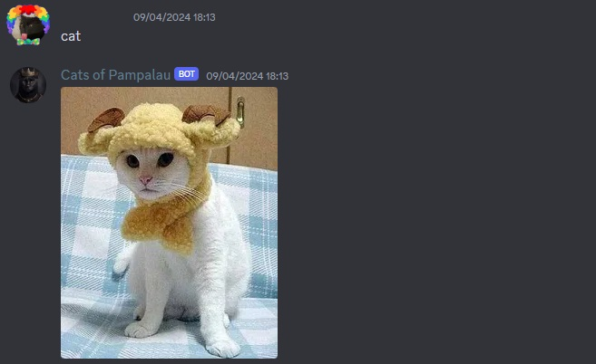

# Discord-Cat-Bot

This is a cute Discord bot which responds with an image of a cat whenever a user types a related word. The bot will respond to the following:

- ['cat', 'cats', 'kitten', 'kittens', 'kitty', 'kitties', 'feline', 'felines', 'meow', 'purr', 'paws', 'whiskers', 'claws', 'tail', 'fur', 'purr', 'pussy','puss', 'pussycat', 'pussycats', 'kittycat', 'kittycats', 'kitty-cat', 'kitty-cats']

When a user types one of the words above in a text channel, the bot will respond, like so: 

## Usage

This bot runs locally on your machine, and in order for it to respond, you must have the script running when needed. You must create a .env file in the script directory, create a variable DISCORD_TOKEN and assign it your bots Discord token from Discord developer portal.

I recommend watching this video, up to 6:34 on how to setup a Discord bot and invite to your server.

Create Your Own Discord Bot in Python 3.12 Tutorial (2024 Edition), https://www.youtube.com/watch?v=UYJDKSah-Ww